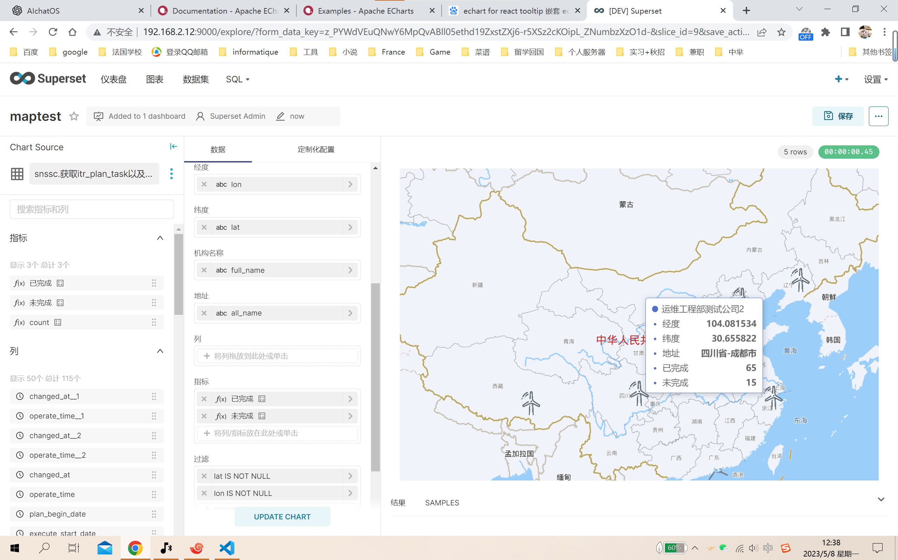

# superset-plugin-chart-baidu-map

This is the Superset Plugin Chart Baidu Map Superset Chart Plugin.

### Usage

To build the plugin, run the following commands:

```
npm ci
npm run build
```

Alternatively, to run the plugin in development mode (=rebuilding whenever changes are made), start the dev server with the following command:

```
npm run dev
```

To add the package to Superset, go to the `superset-frontend` subdirectory in your Superset source folder (assuming both the `superset-plugin-chart-baidu-map` plugin and `superset` repos are in the same root directory) and run
```
npm i -S ../../superset-plugin-chart-baidu-map
```

After this edit the `superset-frontend/src/visualizations/presets/MainPreset.js` and make the following changes:

```js
import { SupersetPluginChartBaiduMap } from 'superset-plugin-chart-baidu-map';
```

to import the plugin and later add the following to the array that's passed to the `plugins` property:
```js
new SupersetPluginChartBaiduMap().configure({ key: 'superset-plugin-chart-baidu-map' }),
```

After that the plugin should show up when you run Superset, e.g. the development server:

```
npm run dev-server
```

### view
