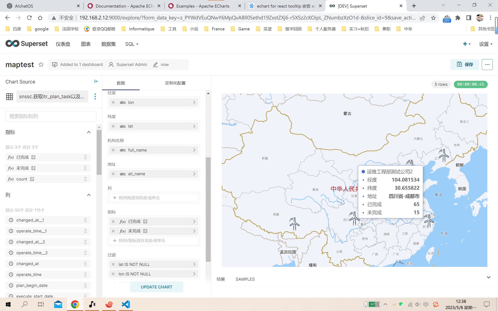
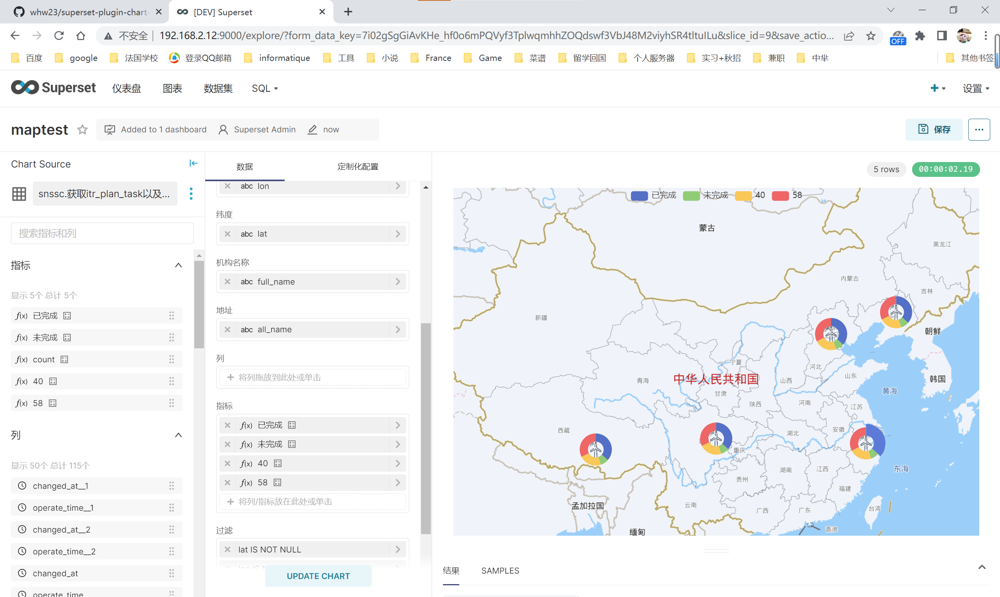

# superset-plugin-chart-baidu-map

This is the Superset Plugin Chart Baidu Map Superset Chart Plugin.
### view


### Usage

To build the plugin, run the following commands:

```
mkdir /tmp/superset-plugin-chart-baidu-map
cd /tmp/superset-plugin-chart-baidu-map
git init
git clone https://github.com/whw23/superset-plugin-chart-baidu-map.git
npm ci
npm run build
```

Alternatively, to run the plugin in development mode (=rebuilding whenever changes are made), start the dev server with the following command:

```
npm run dev
```

To add the package to Superset, go to the `superset-frontend` subdirectory in your Superset source folder (the `superset-plugin-chart-baidu-map` plugin is in /tmp and `superset` repos is in /app), run
```
cd /app/superset-frontend
npm i -S /tmp/superset-plugin-chart-baidu-map
```

After this edit the `superset-frontend/src/visualizations/presets/MainPreset.js` and make the following changes:

```js
import { SupersetPluginChartBaiduMap } from 'superset-plugin-chart-baidu-map';
```

to import the plugin and later add the following to the array that's passed to the `plugins` property ( add this part in `export default class MainPreset extends Preset` after line `...experimentalplugins, `):
```js
new SupersetPluginChartBaiduMap().configure({
          key: 'ext-baidu-map',
        }),
```

After that the plugin should show up when you run Superset, 

e.g. the development server, (default port 9000):

```
npm run dev-server
```

e.g. Or you can rebuild superset:
```
npm run build
```
If you rebuild superset, please restart superset or restart the docker of your superset.

### baidu map api
1. /app/superset/templates/tail_js_custom_extra.html\
add
```
<script type="text/javascript" src="https://api.map.baidu.com/api?v=3.0&ak=YOUR_API_KEY"></script>
```
You should restart superset or restart the docker of your superset.

2. [ak](https://lbsyun.baidu.com/) is your baidu map api. 

Please select the application type（应用类别） as "browser-side"（浏览器端）.